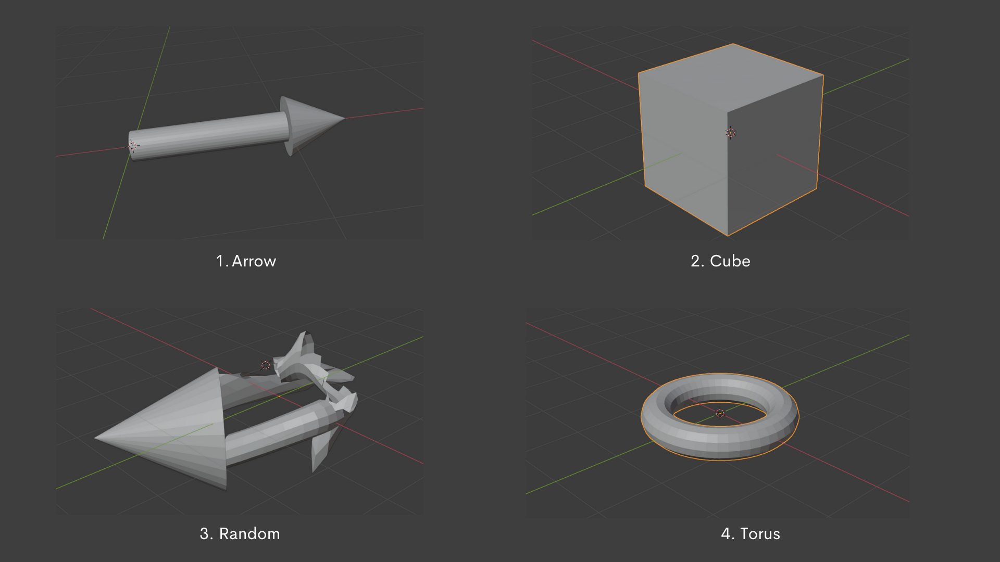
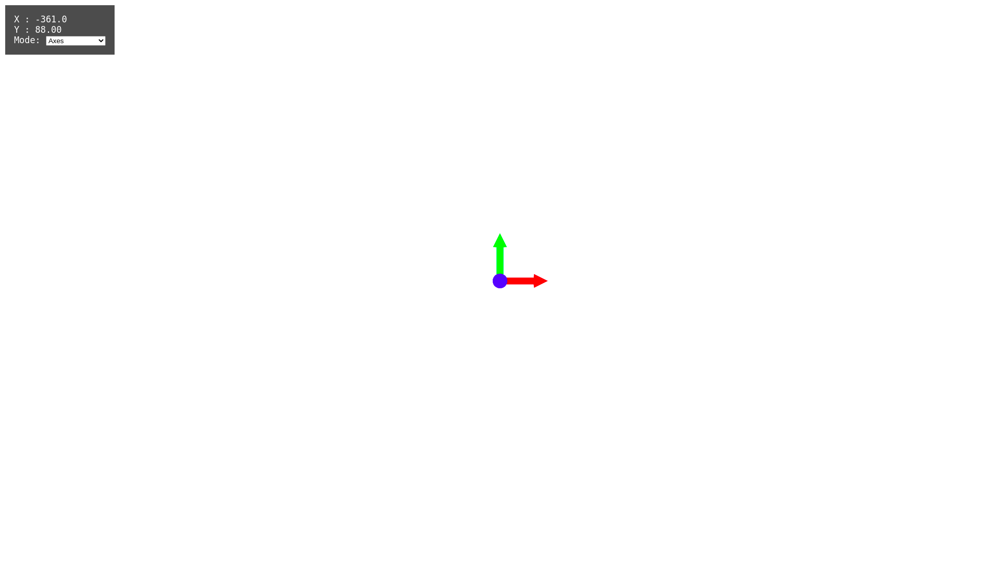
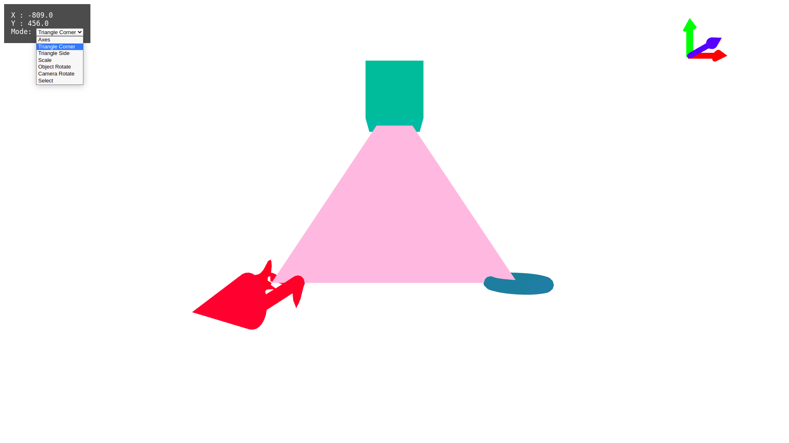
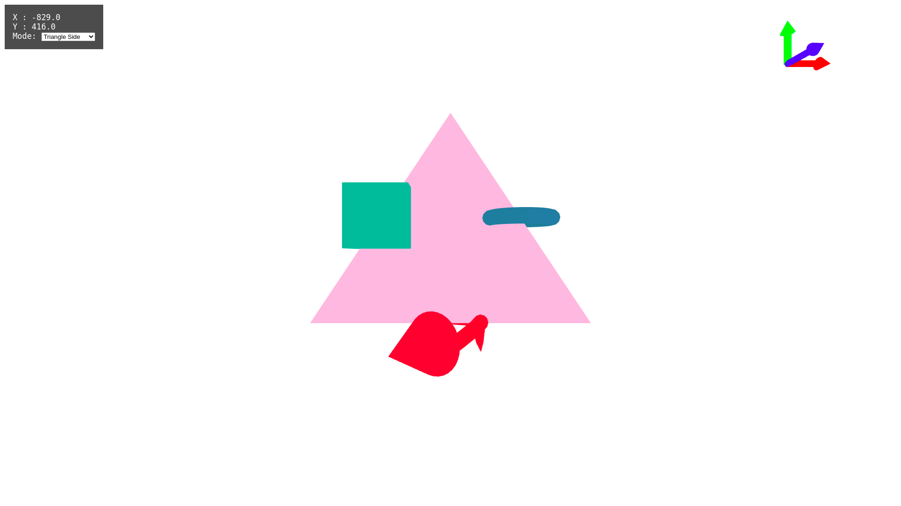
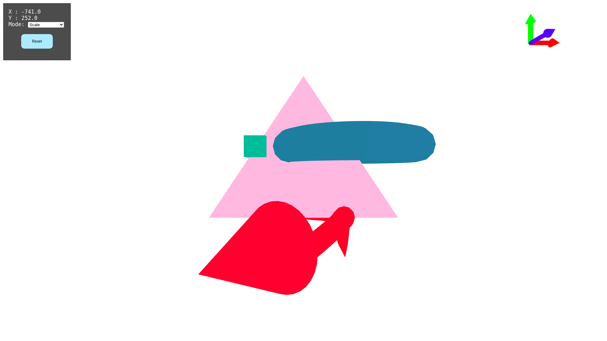
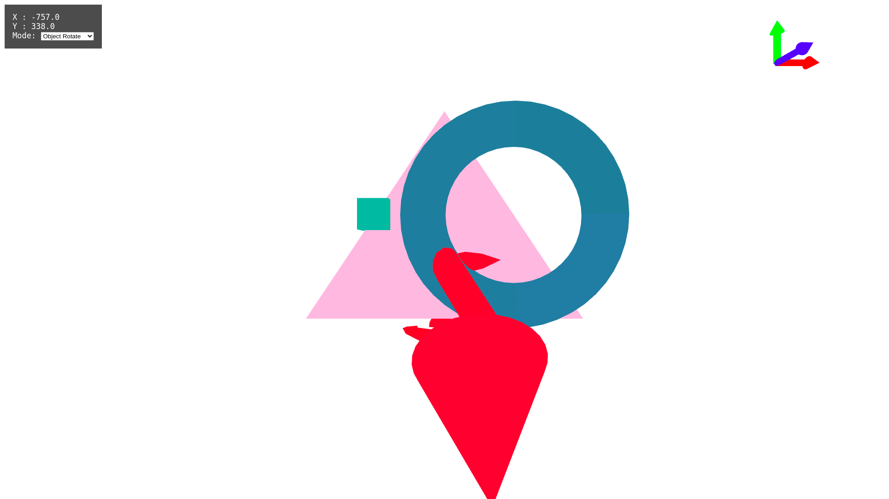
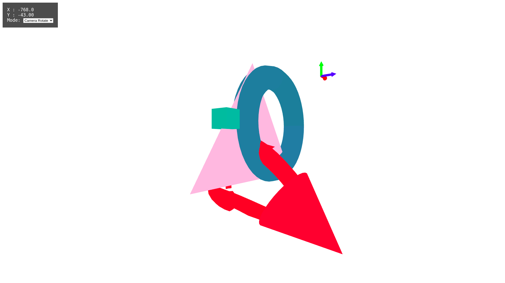
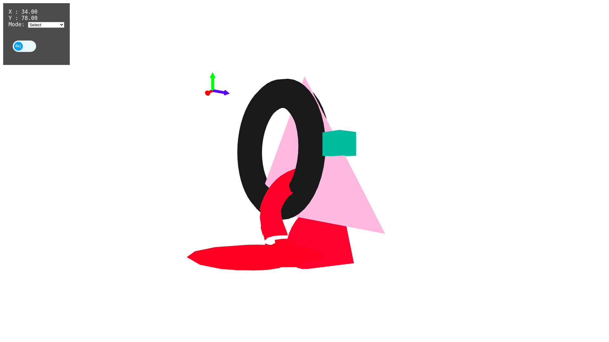
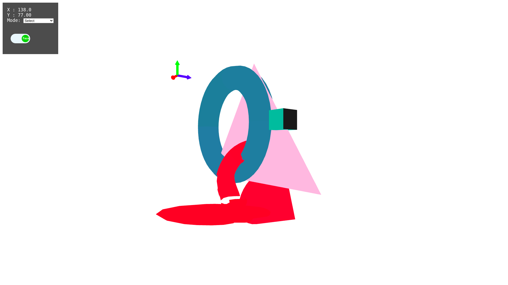

# Overview
This program is an introduction into 3D graphics in WebGL and builds upon [this](https://github.com/agam-kashyap/Computer-Graphics-2D) codebase. The program consists of four 3D objects upon which we perform various actions such as translations, rotation, scaling. 


*Shows the four different models used in the program*

# Instructions

Run the program with a live server.

By default the program is in **Axes** mode. The drop down box on the left of the screen can be used to change the modes.

***Note: The user can switch between any mode.***

The different modes are:

```
Axes: Shows the world coordinates
```

```
Triangle Corner: Places the three objects drawn at the Corners of a triangle positioned at the origin of the scene. World Coordinate Axes placed at the screen corner. 
```

```
Triangle Side: Objects translated to the mid-points of the sides of the triangle.
```

```
Scale: Scales -
        Cube by 0.5
        Random by 2
        Torus by 3
```

```
Object Rotate: Rotates the Cube about Y axis by 90 degrees
               Rotates the torus about the X axis by 90 degrees
               Rotates the Random about the Z axis by 90 degrees

    Press "r" key to keep rotating the objects about the specified axis by 90 degrees.
```

```
Camera Rotate: Rotates the camera about the Y axis. 
    Press the left mouse button and drag to rotate.
    Alternatively, use left and right arrow keys to rotate. 
```

```
Select: 
    Obj: Selects the Object when clicked on it.
    Face: Selects a specific face of the object when clicked.
```

*Torus Selected*

*One face of Cube selected*

# File Structure

- Source
  - 3DMesh.js
  - Arrow.js
  - fragment.js
  - index.js
  - renderer.js
  - shader.js
  - SuperMesh.js
  - transform.js
  - Triangle.js
  - vertex.js
  - index.html
  - globalStyle.css
  - models
    - Arrow.obj
    - Cube
      - Side1.obj
      - Side2.obj
      - Side3.obj
      - Side4.obj
      - Side5.obj
      - Side6.obj
    - Torus
      - TQuater1.obj
      - TQuater2.obj
      - TQuater3.obj
      - TQuater4.obj
    - Surprise
      - RandomPart1.obj
      - RandomPart2.obj
      - RandomPart3.obj
      - RandomPart4.obj
- Report.pdf
- Images
- VideoReport.mp4